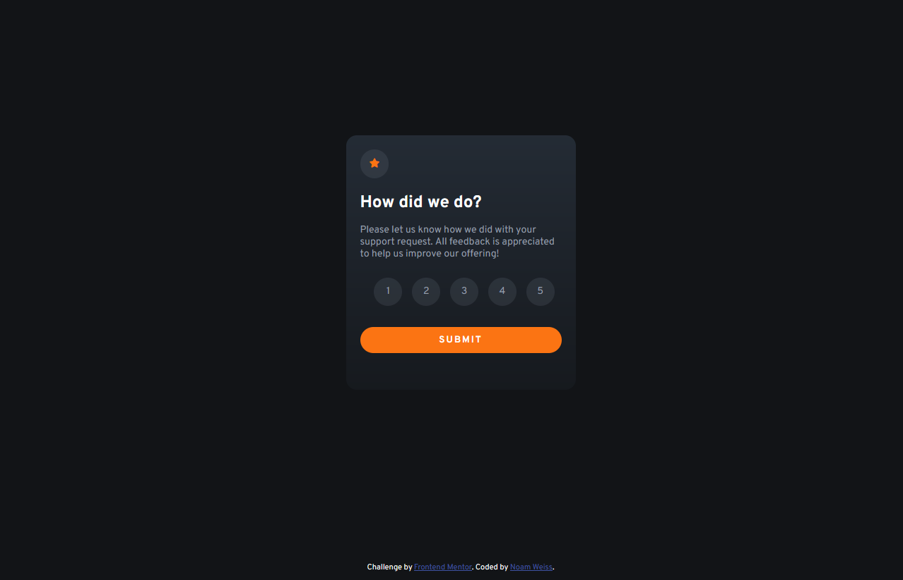

# Frontend Mentor - Interactive rating component solution

This is a solution to the [Interactive rating component challenge on Frontend Mentor](https://www.frontendmentor.io/challenges/interactive-rating-component-koxpeBUmI). Frontend Mentor challenges help you improve your coding skills by building realistic projects. This is my second challenge overall, and my first onr involving Javascript.  

## Table of contents

- [Overview](#overview)
  - [The challenge](#the-challenge)
  - [Screenshot](#screenshot)
  - [Links](#links)
- [My process](#my-process)
  - [Built with](#built-with)
  - [What I learned](#what-i-learned)
  - [Continued development](#continued-development)
- [Author](#author)


**Note: Delete this note and update the table of contents based on what sections you keep.**

## Overview

### The challenge

Users should be able to:

- See hover states for all interactive elements on the page
- Select and submit a number rating
- See the "Thank you" card state after submitting a rating

### Screenshot



### Links

- Solution URL: (https://your-solution-url.com)
- Live Site URL: (https://noamweisss.github.io/RatingSystem-FrontendMentor/)

## My process

### Built with

- Semantic HTML5 markup
- Flexbox
- Mobile-first workflow
- CSS pseudo Elements
- Vanilla Javascript
- Event Listeners
- ForEach Method


### What I learned

I learned so much durig this project. Before this, I didn't really do anything meaningful with Javascript, and I no idea how to approach this language and programming in general. For this project, I basically learned an enire new concept from scratch - but I am very proud of the result.

#### The  HTML
The basic HTML marks are acually not that complex, but I did have some trouble trying to figure out how to make the divs around the numbers circular. Eventually, this what I came up with:
```html
<section>
      <div class="number" id="1">
        <p>1</p>
      </div>
      <div class="number" id="2">
        <p>2</p>
      </div>
      <div class="number" id="3">
        <p>3</p>
      </div>
      <div class="number" id="4">
        <p>4</p>
      </div>
      <div class="number" id="5">
        <p>5</p>
      </div>
    </section>
```
I'm actually not completely sure **why** it worked, But I think the text directly inside the div somehow inerferred with the width proerty I was trying to set. I also used the *id* attribute for the JS app, as I will shortly explain, but I am sure that there better ways to do both this and the circular divs.

#### The CSS
This is an absoulte "I should have writen it with SASS" project. I totally regret going on vanilla CSS here as my stylesheet turned up messy and unreadable (at list that what I think with my little to no experince, I might be Wrong). Hoever, I am proud of this: 
```css
.hidden {
    transform: translate(0, 100vh);
 }
```

This allowd the Switching animation to a little more dynamic and interesting.

#### The Script
this was, by far, the hardest part of the challenge. I had no idea how to approach this; I didn't know basic JS syntax or even what is possible with JS and what isn't. I took it step by step, first I showed myself that I can store the value of the rating eith a variable using the ```console.log``` function, and from ther started playing with the logic - adding classes, removing classes, it was actually quite fun. One big challenged I am glad I was able to overcome was how to make all the othr buttons lose focus one one is clicked.
```js
function activate() {
        numbers.forEach(number => {
            number.classList.remove("active");    
        });
        number.classList.add("active");
        score = number.id;
        scoreBox.innerHTML = "You selected " + score +" out of 5"
    }

```


### Continued development

I am planning on re-writing the entire stylesheet as a set of SASS components, so it will be more scalable and reusable. 
I also want to disable the submit button by default and make it clickable only after the user chose a rating; however, I am yet to learn how to do it.

## Author

- Website - [My Design Portfolio](https://www.noamweisss.com)
- Frontend Mentor - [@noamweisss](https://www.frontendmentor.io/profile/noamweisss)

